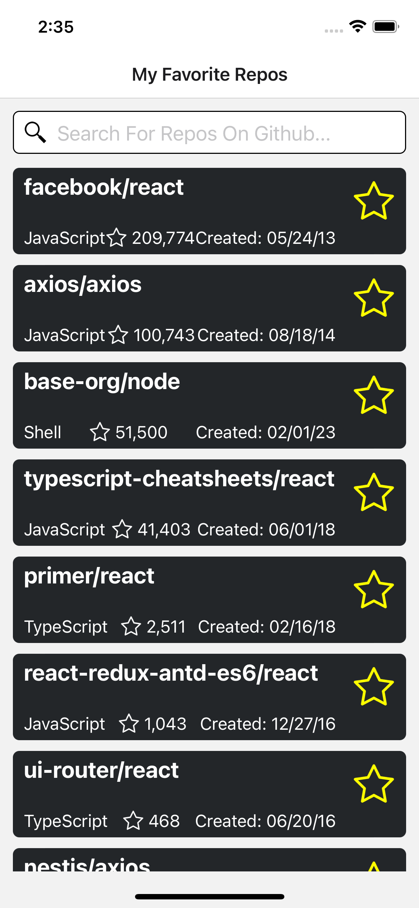
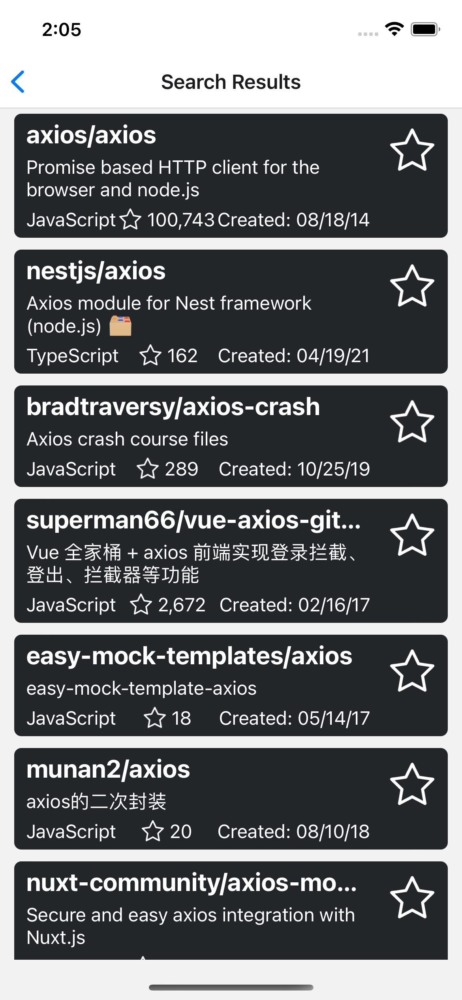
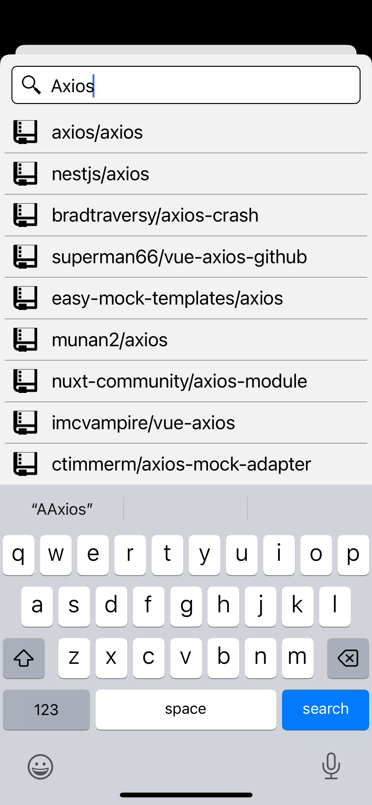
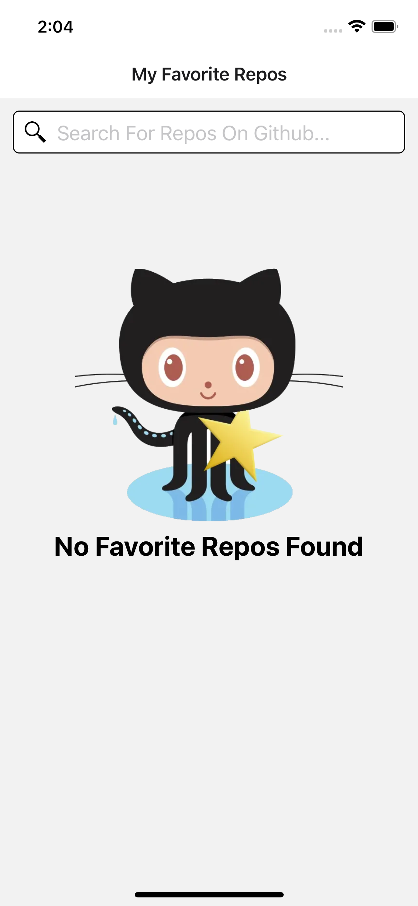
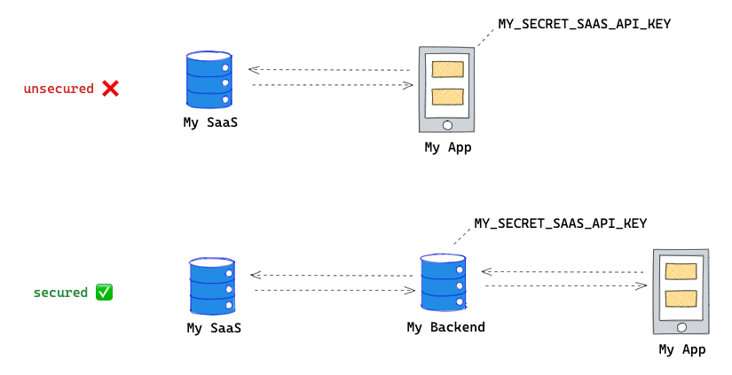

# Favorite Repos

   

$~$

# To Evaluator

I wrote down all my reasonings and thoughts in this file. My justifications for what I did can be found here, at least the ones I could think of off the top of my head. Most of my work is done for a reason, but I may have overlooked something while developing and just simply didn't write it down here. Thanks for your consideration.

# Install

Typically you'll simply need:

```
npm install
```

and for iOS:

```
cd ios

bundle exec pod install

cd ..
```

If you don't have cocoapods and bundler, you need to setup gems first:

```
gem install bundler
```

and

```
bundle install
```

Then to get cocoapods specifically:

```
gem install cocoapods
```

# How To Run

NOTE: This project was primarily developed using an iOS simulator (Android was at various points tested, but not thoroughly tested -- yes, not ideal for production ready products, but since this isn't production product, I am pointing this out that this is not what I would normally do but given my limited time, this is what I did). If you're using an android emulator, make sure you set your local IP address (android does not seem to like when you use http://localhost, it prefers an actual local ip address instead in order to speak to the docker server). `SERVER_URL` can be found in the `Home.tsx` file (line 20, last I checked). Otherwise, it should work as is on iOS, without modification. Run the following, in terminal.

To get metro up and running:

```
npm run start
```

Then, in a separate terminal, for iOS:

```
npm run ios
```

Or for android instead:

```
npm run android
```

You should have the docker server running. More instructions related to the docker image server can be found in the `INSTRUCTIONS_RN.md` file, if unfamiliar.

## iOS Simulator troubleshoot

If the virtual keyboard is not showing up upon input focus. Via the menu, uncheck:

```
 I/O > Keyboard > Connect Hardware Keyboard
```

or use the shortcut `Shift + Cmd + K `

# How The App Works

The home page displays currently favorite repos. This will be blank initially (or rather you should be greeted by Octocat). To add repos, tap the search text input. Should bring up a modal for search purposes, it is here where you can search a given term . Once the `Search` button is is hit on the virtual keyboard (or a suggested search term is tapped), it should navigate to the search results page. It is here where you can simply tap the large `favorite star` (which will appear white if not chosen yet). Upon pressing/tapping the star, it should turn yellow to indicate it has been added to your favorites. This can be further verified by browsing back to the home page, where your chosen favorite repos will be displayed. You can remove repos on the home page or the results page, by simply touching/tapping the yellow stars for each respective repo.

# Reasoning and Justifications

## TypeScript

React-Native is now TypeScript by default since 0.71. TypeScript is not only great for type checking in general, but a great alternative to using proptypes, which was the old and classical way to prop check back in the day for react.

## Testing

Testing was all done manually, and normally I would not be ok with this if this were a real world work project. However, I have limited personal free time on my end. Having that said, having no tests is generally not recommended for delivering apps or new features within a production level release and/or deployments. Unit, end-to-end, and integration testing are all key parts of the development process. Some projects include QA engineers, as an additional layer check of the development process as well and I do find them to be a great benefit in keeping myself honest with my work.

## Modules / Packages

- React-Navigation: was installed to provide navigation capabilities, the type you expect of any mobile app

- Axios: was added to serve as an HTTP client, could have used fetch(), but Axios is straight forward and predictable and reliable. It's also more capable, in terms of features. Which is probably an overkill for this, but it is my go to, personally. It is implemented using a custom hook for ease of use and loading state management. It is used to interact with the server and Github API.

- Moment: my go to for date formatting. Why re-invent the wheel if the wheel is there? There are more light weight alternatives, but I'm sticking with this to speed up the development process on my end. It is reliable.

- Lodash: again, why re-invent the wheel? Lodash provides all sorts of reliable and tested utilities. I specifically used it for its debounce function. The purpose of it is to control requests made to github API, I don't want requests being sent multiple times every time a user modifies their search term or as they are type in real-time. It's bad practice. While you certainly won't DDoS a service, you can easily reach your alloted limit, and ultimately repeatedly querying the service erroneously without setting guard rails and limits is a waste of resources.

- @reduxjs/toolkit: this was installed to handle global state management. The favorite repos are stored in redux. This is because, while this data is displayed on the `Home` page, it is modified on the `Results` page, in order to add or delete existing favorite repos. I am also able to track how many repos have been included by a user. Seeing as 10 is the max allowed by the instructions found in `INSTRUCTIONS_RN.md`, it only made sense to handle that data globally. Lastly, this tool was used over say something like `Context` simply because Redux is more suitable for global state management, where as `Context` is more suited to avoid prop drilling. One could use it, but I declined to.

- Toast: this was simply included in order to inform the user that the maximum allowed favorite repos has been reached. Quick and easy, saved development time.

## React project structure

The project structure can be very subjective, but my approach reasoned based on organizing areas of logical code with one another. This is ideal as a project becomes more larger. Since React isn't opinionated in that sense, it helps to get ahead of it and create structure in order to be able to maintain an adequate ease of use and maintainability (assuming this were to become a much larger project anyway). It's also good practice!

## Token

It's not generally recommended to store any type of token keys to any key services in a React app, so this isn't good practice. Potentially a malicious user could do all sorts of malicious things with the token, such as obtaining sensitive data or running up server usage and costs for nefarious purposes. Usually you'd want the token/key stored in some backend service, where users don't have any sort of access e.g.



But for simplicity and getting this done on time, I'm not concerned about it solely for this interview project.

## Errors

Errors should generally be logged by some type of service, something like Splunk or Bugsnag, or anything similar with error logging capabilities. It allows us to monitor areas where users are experiencing issues. For the purpose of this project, I'm simply doing console.log()s. While great for local debugging, not ideal for production.

## Hardcoded URLs

You don't normally want to hard code URLs directly. You'd normally would want a more dynamic approach. Considering in the development process, applications undergo different environments, and those environments require different configuration, such as different URLs, but again for simplicity and to get this done now you may see hardcoded URLs
